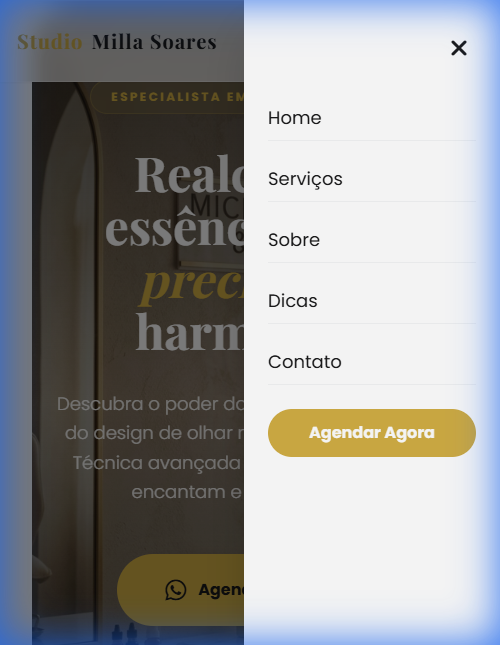
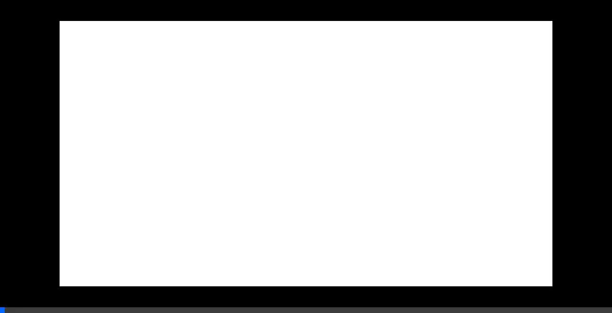

# Studio Milla Soares - Landing Page Modernizada

Uma landing page premium, profissional e totalmente responsiva desenvolvida para o **Studio Milla Soares**, especialista em micropigmentação e design de olhar em Salvador - BA.

## 🔗 Links Úteis

- **Demo:** [https://studio-milla-soares.vercel.app/](https://studio-milla-soares.vercel.app/)
- **Repositório:** [https://github.com/fau-33/-studio_milla_soares](https://github.com/fau-33/-studio_milla_soares)

## 🛠️ Tecnologias Utilizadas

O projeto foi construído utilizando as melhores práticas de desenvolvimento web moderno:

- **HTML5 & CSS3**: Estrutura semântica e estilização avançada.
- **Tailwind CSS**: Framework utilitário para um design moderno e responsivo.
- **JavaScript (Vanilla)**: Lógica para menu mobile, interações e scroll suave.
- **AOS (Animate On Scroll)**: Biblioteca para animações fluidas ao rolar a página.
- **Font Awesome**: Ícones vetoriais elegantes.
- **Google Fonts**: Tipografia premium (_Playfair Display_ e _Poppins_).

## ✨ Funcionalidades

- **Design Premium**: Paleta de cores "Champagne & Gold" com efeitos de Glassmorphism.
- **Totalmente Responsivo**: Experiência otimizada para Desktop, Tablet e Mobile.
- **Menu Mobile Funcional**: Navegação intuitiva em dispositivos móveis.
- **Animações de Entrada**: Elementos que surgem suavemente conforme o scroll.
- **Seção de Depoimentos**: Social proof para aumentar a conversão.
- **FAQ (Dúvidas Frequentes)**: Acordeões interativos para melhorar o UX.
- **Botões de CTA Estratégicos**: Foco total em agendamento via WhatsApp.

## 📸 Previsualização

### Desktop

### Mobile

  
  

### Demonstração de Responsividade e Animações

---

Desenvolvido com foco em alta performance e autoridade visual.
**Flávio Félix** – Desenvolvedor Responsável
